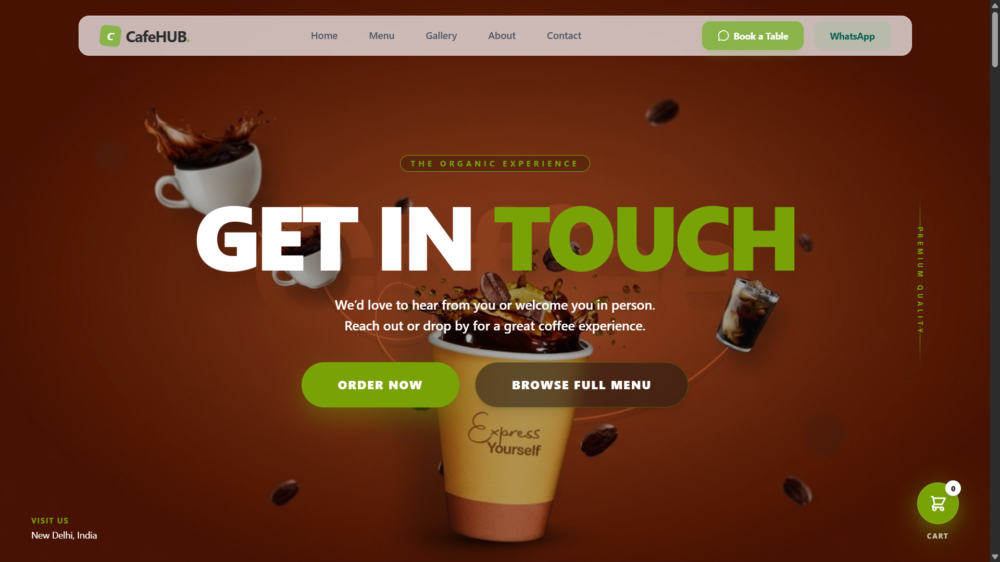
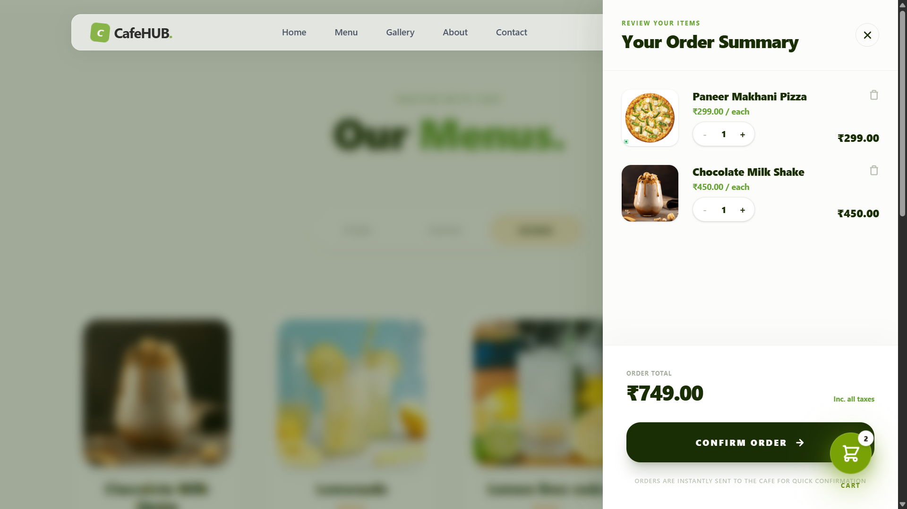

# CafeHUB – Cafe Website & Ordering Platform

CafeHUB is a responsive cafe website built with React and Firebase. It allows customers to explore the cafe menu, add items to their cart, place orders through WhatsApp, and book a table.

The project also includes an admin interface for managing menu categories and items.

## Live Demo

- **Website:** https://cafe-hub-indol.vercel.app
- **GitHub Repository:** https://github.com/ShrutiChauhan24/CafeHUB

## Features

### Customer Features

- Browse cafe menu
- Browse items by category
- View product details
- Add items to cart
- Update cart quantities
- Cart persistence using localStorage
- Place orders through WhatsApp
- Book a table
- View customer reviews
- Links to external food delivery platforms

### Admin Features

- Admin authentication
- Manage menu categories
- Add, edit and delete menu items
- Upload and manage menu images
- Manage menu content

## Tech Stack

### Frontend

- React.js
- JavaScript
- Vite
- CSS

### Backend / Services

- Firebase
- Cloudinary

### Other

- LocalStorage
- WhatsApp integration

## Screenshots

### Homepage



### Menu


### Shopping Cart




## Project Structure

```text
CafeHUB/
├── public/
├── src/
│   ├── assets/
│   ├── components/
│   ├── context/
│   ├── helper/
│   ├── layout/
│   ├── pages/
│   ├── App.css
│   ├── App.jsx
│   ├── firebase.js
│   └── main.jsx
├── .gitignore
├── README.md
├── eslint.config.js
├── index.html
├── package-lock.json
└── package.json
```

# Getting Started
Prerequisites
Node.js
npm
Firebase project configuration
Installation
Clone the repository:
git clone https://github.com/ShrutiChauhan24/CafeHUB.git
Navigate to the project directory:
cd cafeHUB
Install dependencies:
npm install
Configure your Firebase environment variables using the variable names expected by your application. Keep private credentials out of the repository.
Start the development server:
npm run dev


External Services

CafeHUB uses the following services:

Firebase – application data and authentication
Cloudinary – image storage
WhatsApp – customer order communication
Zomato / Swiggy / EazyDiner – external ordering/platform links
Developer

Shruti Chauhan
Self-Taught Full-Stack MERN Developer


